# patrick maloney
### yo

software engineer based in munich. i build full-stack web apps and care a lot about making the frontend feel obvious instead of painful.

currently a lead engineer at [squer solutions](https://squer.io), working across angular and typescript projects for clients in germany and austria.

outside of work: music, chess, and walks with my rescue dog dublin.

**portfolio:** [prmaloney.com](https://www.prmaloney.com) &nbsp;·&nbsp; [linkedin](https://linkedin.com/in/prmaloney) &nbsp;·&nbsp; [email](mailto:pmaloney16@gmail.com)

---

